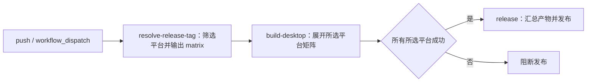
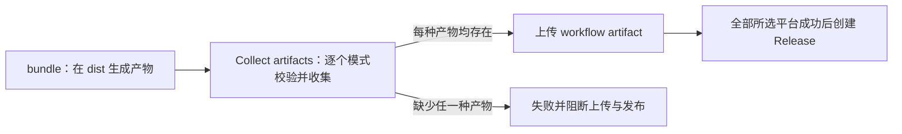

# Spec: Desktop CI 打包与 Release 平台选择

## 背景与目标

仓库提供 Windows、macOS、Linux 单平台打包 workflow，以及汇总发布的
`build-desktop-release.yml`。Windows 打包在本仓库的 GitHub 运行环境中同时产出：

1. 正式 NSIS 安装包（`ZCode-<version>-win-<arch>.exe`）；
2. **zip 免安装版（portable）**（`ZCode-<version>-win-<arch>.zip`），解压即用。

个人使用场景：**不做代码签名、不做公证**，不依赖任何 Apple/微软证书 secret。

## 非目标

- Windows 单平台 workflow 仅跑 `windows-latest`、x64；macOS / Linux 由各自的
  workflow 或 Release 矩阵负责。
- 不接自动更新 feed 发布（`publish` 保持现有的 generic localhost 占位）。
- 不改 Preview/production 身份逻辑：CI 默认 `ZCODE_ENV=production`，得到正式 `ZCode`
  身份与无 `_TEST` 后缀的文件名。

## 产品规则

### R1 Windows 打包目标可扩展（zip = portable）

- `packages/desktop/electron-builder.config.js` 的 `win.target` 默认是 `["nsis"]`。
- 环境变量 `ZCODE_DESKTOP_WIN_TARGETS` 接受逗号分隔的 target 列表（如 `nsis,zip`），
  显式设置时覆盖默认 `["nsis"]`；未设置时行为完全不变。
- 取值仅允许 `nsis` / `zip`，出现未知值时打包期直接失败（fail fast，防止拼错的 target
  静默产出非预期产物）。
- zip target 产物即官方 portable 语义：electron-builder 会把 `win-unpacked` 目录打成
  单个 zip，解压后直接运行 `ZCode.exe`，无需安装。个人使用不做任何签名配置
  （不设置 `CSC_LINK` / `WIN_CSC_LINK` 时 electron-builder 对 zip 与 nsis 均不签名）。

### R2 打包脚本能找到 zip 产物

- `packages/desktop/scripts/bundle.mjs` 的 `artifactExtensionsByOs.win` 包含
  `[".exe", ".zip"]`，保证 bundle 收尾的体积审计（audit-bundle-size）能发现
  zip 产物；`audit-bundle-size.mjs` 已有 `.zip` 限额（500 MiB），无需修改。

### R3 CI 构建链路

GitHub Actions 上从零到出包的步骤与仓库既有脚本一一对应：

1. 检出仓库，setup Node（版本取 `mise.toml` 的 24.x），通过 `pnpm/action-setup` 获取 pnpm
   （版本由 `packageManager: pnpm@10.33.2` 锁定）。
2. `pnpm install`（含 desktop 的 `postinstall: node-pty-rebuild`）。
3. `pnpm --filter @zcode/desktop prepare:runtime-assets`：构建 agent JS bundle
   （zcode.cjs）、ripgrep 与 native-search 工具。Windows 打包**不**依赖
   `prepare:remote-assets` 的跨平台原生二进制（远端 SSH/WSL 资产），因此不执行它。
4. `pnpm --filter @zcode/desktop build:no-runtime-assets`：tsup/vite 生产构建。
5. `pnpm --filter @zcode/desktop exec electron-builder --config electron-builder.config.js
--win --x64`，由 bundle.mjs 同款参数直接驱动 electron-builder（带重试逻辑的话直接
   走 `pnpm bundle:desktop -- --os win --arch x64` 更佳，它已包含 prepare/build/校验/
   体积审计全链路，所以 workflow 采用 `pnpm bundle:desktop`）。
6. 产物上传：`dist/` 下的 `.exe` 与 `.zip` 作为 workflow artifacts。

### R4 状态所有权

- 打包目标解析的唯一所有者是 `electron-builder.config.js`（bundle.mjs 不重复解析）。
- 产物文件名继续由 `buildDesktopArtifactName` 单点生成：`ZCode-<version>-win-x64.exe`
  与 `ZCode-<version>-win-x64.zip`（`ZCODE_ENV=production` 时无 `_TEST` 后缀）。

## 接口

| 名称                        | 类型        | 说明                                                            |
| --------------------------- | ----------- | --------------------------------------------------------------- |
| `ZCODE_DESKTOP_WIN_TARGETS` | 环境变量    | 逗号分隔的 Windows 打包 target，允许 `nsis`、`zip`；缺省 `nsis` |
| Windows `workflow_dispatch` | GitHub 事件 | 手动触发；输入 `arch` 仅允许 `x64`，固定 `windows-latest`       |

## Release 平台选择

### 产品规则与所有者

- `v*` tag push 始终构建 `mac`、`win`、`linux`；手动触发 `os=all` 同样构建三平台，
  `os=mac/win/linux` 只创建对应平台的构建任务。
- 平台筛选的唯一所有者是 `resolve-release-tag` job 调用的
  `scripts/resolve-desktop-release-matrix.mjs`。它维护平台元数据并输出已筛选的矩阵；
  `build-desktop` 只消费结果，不再用 job 级 `if` 筛选矩阵项。
- GitHub Actions 在展开矩阵前评估 job 级 `if`，该位置不能引用 `matrix`；
  使用 `strategy.matrix: fromJSON(needs.resolve-release-tag.outputs.matrix)` 传递结果。
- 平台 runner、默认架构、打包目标和产物扩展名保持现有映射：mac/macOS/arm64、
  win/Windows/x64、linux/Ubuntu/x64。显式 `arch` 仍由构建 job 覆盖默认架构。
- 手动输入缺失或非法时，解析任务失败且不输出矩阵；不静默扩大到三平台。
- 任一选中平台构建失败，`release` 由现有 `needs` 成功依赖阻断；全部成功后才发布。
  `fail-fast: false` 保留，使其余选中平台能继续完成构建。
- 变更仅涉及 CI 调度，不变更桌面端/手机运行时、持久化状态或既有 tag、draft、prerelease 规则。

### 接口与事件顺序

| 接口                | 说明                                                                      |
| ------------------- | ------------------------------------------------------------------------- |
| `GITHUB_EVENT_NAME` | GitHub 内置事件名，tag push 忽略手动平台输入                              |
| `RELEASE_OS`        | workflow 通过 env 传入的 `inputs.os`                                      |
| `GITHUB_OUTPUT`     | 异步追加一行 `matrix={"include":[...]}`，由 step output 暴露为 job output |

### 回归验收

1. tag push 在无 `os` 或存在单平台输入时均输出三平台矩阵。
2. 手动 `all` 输出三平台；手动 `mac`、`win`、`linux` 各输出一个正确的平台行。
3. 非法或缺失的手动平台输入使解析失败，输出文件不增加任何内容。
4. `actionlint` 校验 Release workflow，不再出现 job 级 `matrix` 上下文错误。
5. 使用 `node --test scripts/resolve-desktop-release-matrix.test.mjs` 验证真实脚本的输入、
   输出文件和失败行为；类型检查、lint 与架构检查使用根目录现有命令。

## Release 产物完整性

- `build-desktop` 的 `Collect artifacts` 步骤是本次构建产物集合的唯一所有者。
  矩阵的 `artifact-exts` 经 `ARTIFACT_PATTERNS` 环境变量传入，按空格拆分为模式列表；
  每个模式必须在 `packages/desktop/dist/` 内展开，不能只给第一个模式加目录前缀。
- Windows 必须同时收集 `.exe` 与 `.zip`，macOS 必须同时收集 `.dmg` 与 `.zip`，
  Linux 必须同时收集 `.AppImage` 与 `.deb`。仓库根目录中的同扩展名文件不能被收集。
- 每个模式至少匹配一个普通文件，否则收集步骤失败，并报告缺失的模式。
  后续 workflow artifact 上传和 Release 发布依赖成功结果，不发布不完整的产物集合。
- 修复只改变 Release workflow 的收集步骤；矩阵元数据、打包 target、单平台 workflow
  和最终 Release 上传入口继续使用现有定义。

回归测试 `node --test scripts/desktop-release-artifacts.test.mjs` 直接执行 workflow 中的
Bash 收集步骤，覆盖三平台双产物、带空格的路径与文件名、仓库根目录的干扰 zip、
每个平台缺少任一产物及空 dist。Windows 本地测试通过 `BASH_PATH` 指定 Git Bash；
Linux / macOS 默认使用 PATH 中的 Bash。

## 验收场景

1. **默认不变**：不设置 `ZCODE_DESKTOP_WIN_TARGETS` 时，config 的 `win.target` 仍为
   `["nsis"]`，现有打包链路不受影响。
2. **扩展 target**：设置 `ZCODE_DESKTOP_WIN_TARGETS=nsis,zip` 时，`win.target` 等于
   `["nsis","zip"]`，一次打包同时产出安装包与 zip 版。
3. **非法值失败**：`ZCODE_DESKTOP_WIN_TARGETS=dmg` 时 config 加载即抛错。
4. **CI 出包**：手动触发 workflow 后，artifacts 中同时存在 `.exe` 与 `.zip` 两个产物，
   文件名形如 `ZCode-3.14.3-win-x64.exe` / `ZCode-3.14.3-win-x64.zip`。
